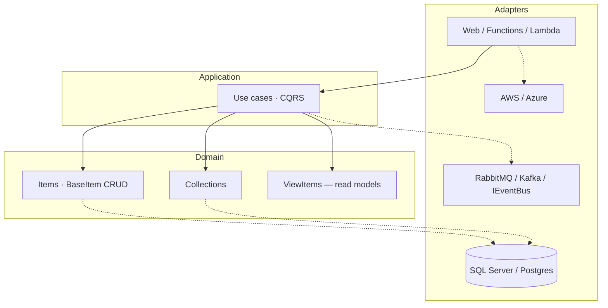
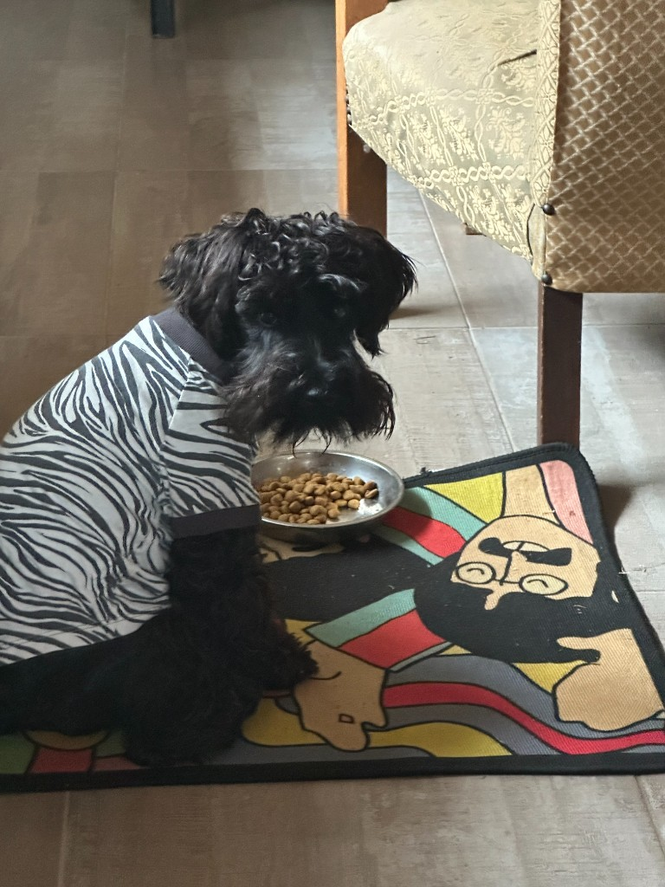

  

 

  
   
  

<h1 align="center">FRANS ELSTADT</h1>

  <b>Senior .NET Architect &amp; Cloud Engineer</b> 
  I design the system. I write the SQL. I ship it. I stay on-call. 
  Los Angeles · California · US authorized · 15+ years in production

  
  
  
  

  

---

## Scoreboard

I do not collect frameworks. I collect **systems that moved money, freight, audits, and health data** — and did not go down doing it.

| 15+ yrs | 4 continents | 1,200 trucks | 20,000+ reports/yr |
| :---: | :---: | :---: | :---: |
| full SDLC ownership | IFRS / GAAP / XBRL live | nationwide logistics | Mitig8, built solo |
| **6 engineers** | **5 banks** | **⅓ report time** | **100th %ile** |
| led in Jira, daily releases | EMV / ISO 8583 / PAIN XML | zero-downtime SQL→Postgres | AWS Networking |

  
  
  
  

Most “senior” profiles are a list of tools. Mine is a list of **blast radius I was trusted with**.

---

## Production tenure

### Draftworx — global multi-tenant audit
**Senior Software Engineer** · May 2024 – Mar 2026

C# .NET + SQL Server platform on **US GAAP, UK IFRS, XBRL**. Deployed to audit firms across **Europe, Africa, Australia, the United States**. Banks on SWIFT. Government and law-enforcement tenants. Multi-jurisdiction RBAC.

- Led **6 engineers**: planning, reviews, architecture, C-suite, daily releases across time zones.
- Event-driven core: **RabbitMQ + Kafka**, versioned REST that does not break client integrations.
- Financial-report SQL rewritten from **execution plans** — indexes, N+1 gone, set-based. C# async, pooling, memory on the hot path.
- Code-first UI abstraction over Infragistics so composition was a standard, not a personality.
- One codebase, two clouds: CI/CD invokes **Azure or AWS CLI** from pipeline parameters. Compliance clients do not get a fork.
- ERP adjacency: **SAP, Sage, IBM TM1, QuickBooks, Pastel**.

### Mitig8 — national insurance SaaS, one engineer
**Founder** · Elstadt Industries · Apr 2023 – May 2024

I did not “contribute.” I **built the company software**. [`Mitig8-WEB`](https://github.com/franselstadt/Mitig8-WEB) is the original production web: insurers, brokers, surveyors, quoting, valuations, surveys, wallets, invoices.

- **20,000+ reports / year** — Bryte, Discover, all five major South African banks.
- Payment rails I certified myself: **EMV · ISO 8583 · QR wallets · PAIN XML** batch, reconciliation, audit trails.
- Schema, APIs, billing, security, Linux firmware, 24/7 incident response. Sole operator. No data-integrity failures.
- 80+ tables, 200+ procedures, now being lifted onto Domain / Application / Architecture / Infrastructure without throwing away the business.

### City Logistics — 1,200-truck national platform
**Staff Software Engineer** · Feb 2016 – Oct 2022

Six years on the system that ran the fleet: warehouse, scan, telematics, costing, KPI, finance.

- **OnRoute** from zero: customer tracking + ETA, dispatch routing, back-office ABC / SLA.
- **Zero-downtime MS SQL → PostgreSQL** on live operations. Parcel and telematics reports to **⅓ of baseline**. CPU cost followed.
- Floor hardware: **Zebra / Honeywell** Android PDAs, Datamax ZPL/DPL/PCL, Twain, Bluetooth scales, serial dinosaurs.
- IBM **Planning Analytics (TM1)** for the CFO — TurboIntegrator from **SAP + Sage VIP**.
- Daily multi-region CI/CD. WinForms monolith → services + cloud web. SLA never used as an excuse to freeze.

### WAM Technology — government health + industrial
**Lead Software Engineer** · Nov 2022 – May 2023

- **South African TB / HIV national registry** under government SLA. Multi-agency. Audit-grade. Wrong data is not a bug, it is a failure.
- Introduced **DDD** (bounded contexts, ubiquitous language) so engineering and the ministry spoke the same nouns.
- **Donkerhoek**: payroll for hundreds of seasonal workers; Android Bluetooth piecework weighing; ESP32 conveyor boards.
- ESP32 diagnostic unit — camera, Linux, **TensorFlow** on Ziehl-Neelsen / auramine O slides. [`Detecting_Tuberculosis_CNN`](https://github.com/franselstadt/Detecting_Tuberculosis_CNN).

### Hatronika · City Venture Capital
**Architect / CTO (concurrent)** · Apr 2023 – May 2024

- **PP500** solar IoT backend on **AWS EC2 / S3 / RDS**: schema, payment gateway, LoRaWAN (terminal → cluster → site → device → firmware).
- Diligence for City Venture Capital: architecture, 65M ZAR ask, hardware off Pi onto industrial boards.

---

## Proofs I put on the public internet

I do not send a PDF and hope. I stand up the architecture.

  
  &nbsp;&nbsp;
  
  &nbsp;&nbsp;
  

| Platform | What you are looking at | URL |
| --- | --- | --- |
| **CityOps Merced** | Government ops: DDD contexts, GASB, California rules, vendor adapters, GIS, WebRTC + live AI transcription, Azure Functions with AWS Lambda twins documented beside them. | [merced.elstadt.com](https://merced.elstadt.com) |
| **Gallo Platform** | Backend-first .NET 10 integration demo: factory floor + **SAP** + SuccessFactors + **UiPath**, Prometheus, versioned `/api/v1`, React consumes the API only. | [gallo.elstadt.com](https://gallo.elstadt.com) |
| **CorVel DataHub** | Event-driven integration hub: domain model, sagas, Azure Functions, translation layer, orchestration portal. | [corvel.elstadt.com](https://corvel.elstadt.com) |
| **BunEHR** | EHR implementing **openEHR REST API v1** — Bun, Hono, Drizzle, PostgreSQL 16. | [github.com/franselstadt/BunEHR](https://github.com/franselstadt/BunEHR) |
| **Mitig8 WEB** | The national insurance web, as shipped. | [github.com/franselstadt/Mitig8-WEB](https://github.com/franselstadt/Mitig8-WEB) |
| **TrajanOne** | Case / medical-record platform in C#. | [github.com/franselstadt/TrajanOne](https://github.com/franselstadt/TrajanOne) |
| **KitchenOS** | C# product system. | [github.com/franselstadt/KitchenOS](https://github.com/franselstadt/KitchenOS) |
| **codebase-memory-mcp** | Code intelligence MCP: persistent graph, 158 languages, sub-ms queries. | [github.com/franselstadt/codebase-memory-mcp](https://github.com/franselstadt/codebase-memory-mcp) |
| **House of Elstadt** | The name is the warranty. | [elstadt.com](https://elstadt.com) |

---

## How I actually design

Dependencies point **inward**. Domain never sees SQL, HTTP, or a cloud SDK. If a domain project references EF, **the build fails**. That is the whole trick. Everything else is taste.

Hot path: **I write the SQL**. Execution plan, clustered vs nonclustered, covering indexes, set-based. Dapper when the plan is the product. ORM when schema velocity is. Same rule on Cosmos/Dynamo: access pattern first, partition key second, no hot partitions.

Brokers sit behind `IEventBus`. Rabbit, Kafka, or in-memory for tests — one DI line. gmvTM-style persistable `BaseItem` / `BaseCollection` (sync + async) for the write model; ViewItems for grids and stats.

---

## Stack

  

| Layer | What I use when it has to work |
| --- | --- |
| **Languages** | C# / .NET (ASP.NET, WPF, WinForms, Blazor), SQL, TypeScript, Java EE, Go, Node |
| **Data** | SQL Server, PostgreSQL, RDS, Cosmos, SQLite — plans, indexes, cutovers, procedures, custom ORMs |
| **Cloud** | AWS EC2/S3/RDS/IAM/VPC · Azure App Services/Functions · Terraform/ARM · Docker/K8s |
| **Integration** | REST, SOAP, RabbitMQ, Kafka, SAP, Sage, TM1, SWIFT |
| **Payments** | EMV, ISO 8583, PAIN XML, QR wallets, reconciliation |
| **Hardware** | Zebra/Honeywell, Datamax, industrial scales, ESP32/STM32/Pi, LoRaWAN |
| **Certs** | AWS Networking **100th %ile** · Azure AI Fundamentals · MCSD · ASCP · IBM TM1 10.1 · CS50x · CCNA I |
| **School** | B.Tech Software Engineering — Nelson Mandela University · Accounting Sciences — UNISA |

---

## GitHub

Public GitHub is the **lab**. The 1,200-truck platform, the bank rails, and the national registry lived behind firewalls. What is here is what I am allowed to show.

  
  

  

  

---

  
  
Daisy. Persistence, loyalty, no drama. The original SRE.

---

  <b>If it has to work on Monday — with auditors, banks, or a live fleet — I am the engineer.</b>  
  <a href="https://elstadt.com">elstadt.com</a> ·
  <a href="https://merced.elstadt.com">CityOps</a> ·
  <a href="https://gallo.elstadt.com">Gallo</a> ·
  <a href="https://corvel.elstadt.com">CorVel</a> ·
  <a href="https://x.com/franselstadt">@franselstadt</a> ·
  <a href="https://linkedin.com/in/frans-elstadt">LinkedIn</a> ·
  <a href="mailto:franselstadt@gmail.com">email</a>

  Unless the Lord builds the house, the builders labor in vain. — Psalm 127:1

