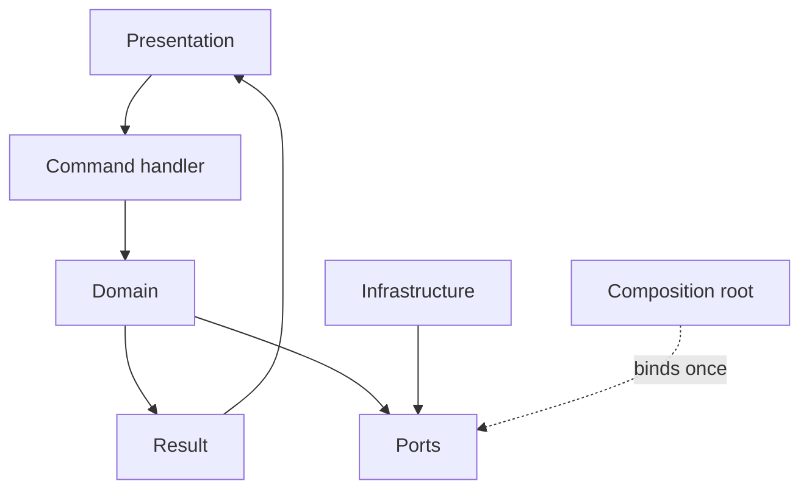

# Frans Elstadt

**Software Engineer**

[Website](https://elstadt.com) · [GitHub](https://github.com/franselstadt) · [LinkedIn](https://linkedin.com/in/frans-elstadt) · [X](https://x.com/franselstadt) · [Email](mailto:franselstadt@gmail.com)

I am a software engineer. I design the domain model, the persistence, the APIs, and the deployment path, then stay with the system in production. The work is usually **regulated and operational**: audit, payments, insurance, logistics, health registries, industrial hardware — software that other teams, banks, or field operators depend on every day.

I write in statically typed languages — **C#**, **Java**, **C++**. The host can be a web API, a desktop, a service, or a job. The interesting part is the types that still make sense when that host changes.

---

## How I think

I start from the names the business already uses. A session, a ledger line, a shipment, a settlement — that becomes an **Item**. A set of them becomes a **Collection**. A query that is not that thing becomes a **ViewItem**. A single business action becomes a **command**: one request, one handler, one response.

Persistence, HTTP, brokers, and cloud SDKs are adapters. Domain has no I/O. If it can import a driver or an ORM, the boundary has already slipped.

Expected failure is a **Result** — a success value or a domain error, both types, matched in the open. Exceptions are for bugs and for I/O the process cannot continue through. States, errors, and events are closed sets so the compiler can see whether every case was handled. Where history is the invariant, the source of truth is an **event stream**; the current row is a projection.

---

## Architecture

Presentation calls Application. Application is commands. Domain is types. Architecture composes the process once, at start. Infrastructure implements ports. Workers take the long jobs — reports, projections, device I/O.

```
Presentation     HTTP, UI, services, jobs
      │
Application      Request → handler → Result<Response>
      │
Domain           Items, Collections, ViewItems, errors, events, ports
      │
Architecture     composition root, session
      │
Infrastructure   store, bus, stream, cloud, hardware
```



Dependencies point inward. Persistence is bound at process start; if it is missing, the process fails closed. A new store or host is new Infrastructure. Domain does not change to add a database.

Persistable types inherit `BaseItem` and own `Create` / `Read` / `Update` / `Delete` (sync and async). Sets inherit `BaseCollection<T>`. ViewItems are read models — they do not pretend to be entities. Domain owns the persistence port; Infrastructure implements it; the composition root assigns it.

SOLID shows up as those boundaries: one reason to change per type, new adapters without editing the model, ViewItems not substituted for Items, small ports, and Domain defining the abstractions that Infrastructure depends on.

---

The repositories below are the rest of the argument.
