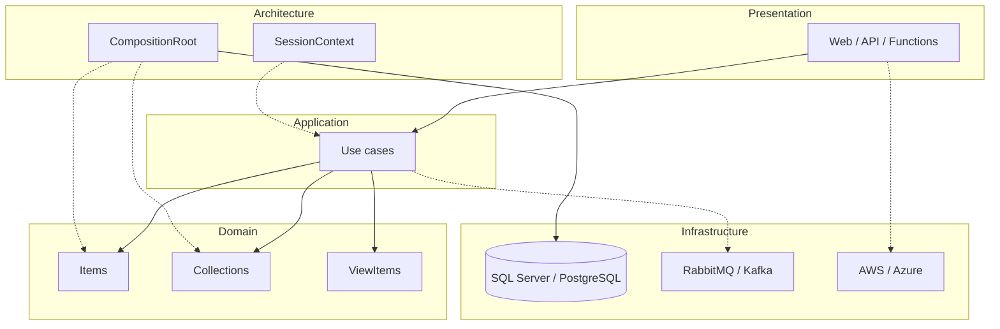

# Frans Elstadt

**Software Engineer** — C# / .NET, domain models, and operational backends.

[Website](https://elstadt.com) · [GitHub](https://github.com/franselstadt) · [LinkedIn](https://linkedin.com/in/frans-elstadt) · [X](https://x.com/franselstadt) · [Email](mailto:franselstadt@gmail.com)

I am a backend and platform engineer. I design the domain model, the persistence, the APIs, and the deployment path, then stay with the system in production. The work is usually **regulated and operational**: audit, payments, insurance, logistics, health registries, industrial hardware — software that other teams, banks, or field operators depend on every day.

I build that software the way a domain works, not the way a framework wants to be used. The model is the product. Persistence, HTTP, brokers, and cloud SDKs are adapters. If the domain project can see Entity Framework, the design is already wrong.

---

## How I design

A screen does not open a `DbContext`. A stored procedure is not a use case. An ORM entity is not a domain object.

Presentation calls **Application**. Application orchestrates **Items** and **Collections**. Architecture **composes** persistence at startup. Infrastructure implements the ports. Domain has no SQL, no UI, no cloud SDK.

```
Presentation          pages, APIs, functions
        │
Application           use cases
        │
Domain                Items + Collections  (no I/O)
        │
Architecture          CompositionRoot, session, catalog
        │
Infrastructure        SQL, brokers, cloud
Workers / Extensions  reports, hardware, shared helpers
```



Dependencies point inward. Domain never references Infrastructure. Architecture is the only place that wires the two together.

---

## Domain: Items and Collections

Persistable types inherit `BaseItem`. They are not DTOs and they are not EF entities. Each item is a thing the business names, and it owns its lifecycle:

`Create` / `Read` / `Update` / `Delete` — sync and async.

Sets of those things inherit `BaseCollection<T>`:

`CreateItems` / `ReadItems` / `UpdateItems` / `DeleteItems` — sync and async.

Shapes that never hit the database are **ViewItems** and **ViewCollections** — worklists, stats, session principals, tokens. They are still types in the domain, not anonymous projections in a controller.

```
Domain/
  Items/
    Base/            BaseItem
    Interfaces/      IItem, IViewItem, IItemPersistence
    View/            read models
    AssessmentItem, UserItem, SessionItem, WalletItem, …
  Collections/
    Base/            BaseCollection<T>
    Interfaces/      IItemCollection<T>, ICollectionPersistence
    View/            worklists and stats
    AssessmentCollection, UserCollection, …
```

`BaseItem.Persistence` is an interface composed at startup. The item calls `Create()`; it does not know whether that is a stored procedure, SQL, or a test double.

Traditional C#: block namespaces, explicit access modifiers on every property, no top-level statements. Collections are not `ICollection<T>` — that name already belongs to the BCL.

---

## Application, Architecture, Infrastructure

**Application** is the verb layer. `AssessmentApplication.ReadActive`, `AuthenticationApplication.IssueToken`. Screens call these. They do not call the database.

**Architecture** is composition, not a dumping ground:

- `CompositionRoot.Compose()` — assign item and collection persistence once, at process start
- `SessionContext` — who is acting
- `ModuleCatalog` / `AppSettings` — what the process is allowed to know about itself

**Infrastructure** maps ports onto the real world: SQL Server / PostgreSQL, stored procedures, brokers, cloud. The EDMX, the EF context, the connection string — those live here. Domain never sees them.

**Workers** run the long jobs (reports, batch settlement). **Extensions** are shared primitives, not a junk drawer.

If a broker is required, it sits behind an application interface. RabbitMQ, Kafka, or an in-memory double can swap without touching a use case.

SQL on the hot path is still written and tuned from execution plans. The domain does not hide that work; Infrastructure owns it.

---

## Why this shape

Operational systems rot when every screen becomes a private database client. The next feature copies the last query. The language of the business leaks out of the code.

Items keep the language. Collections keep bulk behavior. ViewItems keep queries from impersonating entities. Application keeps a use case in one place. Composition keeps I/O out of the model.

Same kernel whether the host is Web Forms, Azure Functions, or a .NET 10 API. The adapters change. The domain does not.

---

## Where it shows up

| | |
| --- | --- |
| [Mitig8-WEB](https://github.com/franselstadt/Mitig8-WEB) | Insurance platform — this kernel over the original production shell |
| [merced.elstadt.com](https://merced.elstadt.com) | Government operations (DDD, GASB, vendor adapters, GIS) |
| [gallo.elstadt.com](https://gallo.elstadt.com) | Integration platform (SAP, SuccessFactors, UiPath, versioned API) |
| [corvel.elstadt.com](https://corvel.elstadt.com) | Event-driven hub (sagas, translation layer) |
| [BunEHR](https://github.com/franselstadt/BunEHR) | openEHR REST API v1 |
| [TrajanOne](https://github.com/franselstadt/TrajanOne) | Case / medical-record platform |

Applied in audit (US GAAP, UK IFRS, XBRL), national logistics (~1,200 trucks), payments (EMV, ISO 8583, PAIN XML), and health registries — always as domain first, adapters second.

---

## Stack

<p align="center">
  
</p>

C# / .NET · SQL Server · PostgreSQL · REST · RabbitMQ · Kafka · AWS · Azure · SAP · Sage · IBM TM1 · EMV / ISO 8583 · Zebra / Honeywell / ESP32 / LoRaWAN

---

<p align="center">
  
  
</p>
