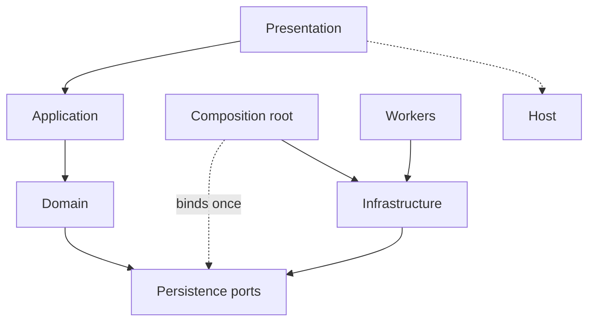

# Frans Elstadt

**Software Engineer**

[Website](https://elstadt.com) · [GitHub](https://github.com/franselstadt) · [LinkedIn](https://linkedin.com/in/frans-elstadt) · [X](https://x.com/franselstadt) · [Email](mailto:franselstadt@gmail.com)

I am a backend and platform engineer. I design the domain model, the persistence, the APIs, and the deployment path, then stay with the system in production. The work is usually **regulated and operational**: audit, payments, insurance, logistics, health registries, industrial hardware — software that other teams, banks, or field operators depend on every day.

I write in **statically typed** languages — C#, Java, C++. The kernel is types, interfaces, and composition. The framework is an adapter, never the model. I build software the way a domain works, not the way a framework wants to be used. Persistence, HTTP, brokers, and cloud SDKs sit outside the types that name the business. If the domain can import a driver, an ORM, or a vendor SDK, the design is already wrong.

---

## Thinking

A system is a set of names the business already uses, plus the invariants those names must keep. Code that cannot say those names without opening a connection is not a model. It is a script.

I do not start from screens, tables, or frameworks. I start from the thing that would still be true if the host, the store, and the cloud all changed: a session, a ledger line, a shipment, a settlement. That thing becomes an **Item**. A set of them becomes a **Collection**. A query that is not that thing becomes a **ViewItem**. A workflow that uses them becomes a use case.

Those are types. In C#, Java, or C++ they are classes and interfaces (abstract classes where the language has no interface). They are not JSON, not table rows, not framework entities.

Everything else is an adapter. Adapters are allowed to be ugly. The domain is not.

Three refusals:

- Presentation does not open a connection.
- A stored procedure is not a use case.
- A persistence row is not a domain type.

If those three hold, the rest of the design has somewhere to live — in any framework, or in none.

---

## Architecture

Presentation calls Application. Application orchestrates Domain. Domain has no I/O. Architecture composes the process once, at start. Infrastructure implements ports. Workers take the long jobs. Extensions are primitives, not a junk drawer.

```
Presentation     host: HTTP, UI, services, jobs
      │
Application      verbs — one use case, one reason to change
      │
Domain           Items, Collections, ViewItems, ports     ← no I/O
      │
Architecture     composition root, session, process catalog
      │
Infrastructure   store, bus, cloud, hardware
Workers          reports, batches, side effects at the edge
```



Dependencies point inward. Domain never references Infrastructure. The only place a concrete store is assigned to an abstract port is the composition root. If persistence has not been composed, the process fails closed. It does not silently no-op.

Spring, ASP.NET, Qt, a raw socket server, a batch job — those are hosts. The host can change. The store can change. The bus can change. The domain does not.

---

## Domain kernel

Persistable types inherit `BaseItem`. They are not DTOs and they are not rows. Each Item is one business name, and it owns its lifecycle:

`Create` / `Read` / `Update` / `Delete` — synchronous and asynchronous.

Sets of those types inherit `BaseCollection<T>` (generics in C# and Java, templates in C++):

`CreateItems` / `ReadItems` / `UpdateItems` / `DeleteItems` — synchronous and asynchronous.

Shapes that never hit the store are `ViewItem` and `ViewCollection<T>`: worklists, stats, principals, tokens. They live in the domain so a query cannot impersonate an entity. A ViewItem has no `Create()`. Substituting it for an Item is a type-system lie — the compiler should refuse it.

```
Domain
  Items
    BaseItem
    Item, ViewItem                 interfaces / abstract classes
    ItemPersistence                port
    ViewItems                      read models
  Collections
    BaseCollection<T>
    ItemCollection<T>              interface / abstract class
    CollectionPersistence          port
    ViewCollections                worklists and projections
```

The Item calls `Create()`. It does not know whether that is SQL, a procedure, a test double, or another process. `ItemPersistence` is owned by Domain. Infrastructure implements it. The composition root assigns it.

Application is the verb layer. The host calls use cases. Use cases call Items and Collections. Nothing below Presentation knows there is a UI. Nothing above Infrastructure knows there is a connection.

---

## SOLID, as shipped

**Single responsibility.** An Item changes when the business concept changes. A use case changes when the workflow changes. An adapter changes when the store, bus, or host changes. Mixing those reasons is how a codebase becomes a private database client in every file.

**Open/closed.** New stores, brokers, and hosts are new Infrastructure. Domain is not edited to add a database. Application is not edited to add a transport. The seam is the port, not a switch in a use case, and not a framework plugin hooked into the model.

**Liskov.** A ViewItem is not an Item. A bag of rows is not a Collection of Items. If a type cannot honor `Create` / `Read` / `Update` / `Delete` without cheating, it does not inherit `BaseItem`. Inheritance is a contract, not a folder.

**Interface segregation.** One-item persistence is not collection persistence. A caller that only reads a worklist does not take `Delete`. Ports are small. A fat unit-of-work in Domain is Infrastructure leaking upward.

**Dependency inversion.** Domain defines the abstractions. Infrastructure depends on Domain, never the reverse. Application depends on Domain. The composition root is the one concrete assignment in the process. Construction of I/O does not happen down the call stack, and it does not happen lazily inside an Item.

The corollary is mechanical: if Domain cannot compile without a framework or a driver on the classpath (or in the include path, or in the package graph), the inversion has already failed.

---

## Constraints I keep

- **Types first.** The model is classes and interfaces. Dynamic maps, untyped payloads, and framework entities are not a domain.
- **Compose once.** Persistence is bound at process start. After that, the graph is closed.
- **Fail closed.** Uncomposed persistence throws. Silent null is a production incident waiting for traffic.
- **Language over tables.** If the business cannot name it, it is not an Item. If it is only a join, it is a ViewItem.
- **One use case, one entry.** A host that needs two workflows calls two application methods. It does not grow a god service.
- **Buses behind ports.** A broker is an implementation. Any bus, or an in-memory double, swaps without touching a use case.
- **Queries stay in Infrastructure.** Hot paths are still written and tuned. The domain does not hide that work and does not perform it.
- **Workers own side effects that are not the model.** Reports, batches, device I/O. They use Infrastructure. They do not become methods on an Item.
- **Explicit over implicit.** Explicit types, explicit visibility, no hidden I/O, no ambient context except session — and session is composed, not scavenged from a static.

This is the same kernel in any language in this family, and in any host. The adapters change. The domain does not.
