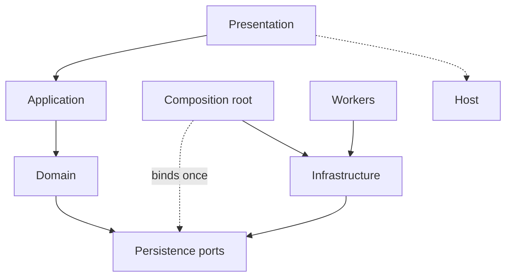

# Frans Elstadt

**Software Engineer**

[Website](https://elstadt.com) · [GitHub](https://github.com/franselstadt) · [LinkedIn](https://linkedin.com/in/frans-elstadt) · [X](https://x.com/franselstadt) · [Email](mailto:franselstadt@gmail.com)

I am a backend and platform engineer. I design the domain model, the persistence, the APIs, and the deployment path, then stay with the system in production. The work is usually **regulated and operational**: audit, payments, insurance, logistics, health registries, industrial hardware — software that other teams, banks, or field operators depend on every day.

I write in **statically typed** languages — C#, Java, C++. Most engineers are fluent in a framework. A framework is a host with opinions. I am fluent in a model that still compiles when the host is gone.

---

## Most engineers, this engineer

The default career is to get fast at the stack of the year. Entities are rows. Services are transaction scripts. Architecture is the folder the tutorial used. SOLID is five slides. DDD is a repository named `Repository`. That ships. It also means the business language never becomes a type, so every new host is a rewrite dressed up as a migration.

I start from the names the business already uses. A session, a ledger line, a shipment, a settlement — that is an **Item**. A set of them is a **Collection**. A query that is not that thing is a **ViewItem**. A workflow is a use case. Persistence, HTTP, the bus, the cloud: adapters. If Domain can import a driver, an ORM, or a vendor SDK, it is not Domain. It is a second Infrastructure that someone named Domain.

The compiler is the design review. Substitutions that other codebases allow, this one refuses.

| Default engineer | This kernel |
| --- | --- |
| Starts from the framework | Starts from the type |
| ORM entity = the domain | Item = the domain; the row is an adapter |
| Controller opens a unit of work | Presentation calls a use case; the use case never sees a connection |
| `Repository` is a DAO with better branding | Persistence is a port **owned by Domain**, bound once |
| DTO in the UI, row in the store, nothing the business can name | ViewItem in Domain — a query is a type, not a map |
| Clean architecture = four folders that still import the ORM | Domain compiles with **zero** drivers |
| SOLID as a slide deck | SOLID as a **failed build** |
| Interface on every class | Small ports — a worklist reader does not take `Delete` |
| One service, forty methods | One use case, one reason to change |
| Microservices as the design | Types first; process topology is Infrastructure |
| DI container as architecture | Composition root is **one assignment**; then the graph is closed |
| Null persistence, catch it later | Uncomposed I/O **throws** |
| New store: edit the model | New store: new Infrastructure |
| Anemic objects + logic in services | Item owns `Create Read Update Delete` |
| Framework entity passed across layers | A persistence row is not a domain type |

Most profiles list a stack. This one states the constraints the stack is not allowed to violate.

---

## Architecture

Presentation calls Application. Application orchestrates Domain. Domain has no I/O. Architecture composes the process once, at start. Infrastructure implements ports. Workers take the long jobs. Extensions are primitives, not a junk drawer.

```
Presentation     host: HTTP, UI, services, jobs
      │
Application      verbs — one use case, one reason to change
      │
Domain           Items, Collections, ViewItems, ports     ← no I/O
      │
Architecture     composition root, session, process catalog
      │
Infrastructure   store, bus, cloud, hardware
Workers          reports, batches, side effects at the edge
```



The usual codebase inverts this in practice: Domain depends on the store, Application is a folder of wrappers, Architecture is unused, Infrastructure is wherever the connection landed. Dependencies here point inward. The only concrete assignment of store → port is the composition root. If that has not run, the process fails closed.

Spring, ASP.NET, Qt, a socket server, a batch job — hosts. The host can change. The store can change. The bus can change. The domain does not.

---

## Domain kernel

Persistable types inherit `BaseItem`. Not a DTO. Not a row. One business name, one lifecycle:

`Create` / `Read` / `Update` / `Delete` — synchronous and asynchronous.

Sets inherit `BaseCollection<T>` (generics in C# and Java, templates in C++):

`CreateItems` / `ReadItems` / `UpdateItems` / `DeleteItems`.

A ViewItem has no `Create()`. If it could inherit `BaseItem`, Liskov would already be broken. The compiler should refuse the substitution other engineers make with a mapper and a comment.

```
Domain
  Items         BaseItem · Item · ViewItem · ItemPersistence
  Collections   BaseCollection<T> · ItemCollection<T> · CollectionPersistence
```

The Item calls `Create()`. It does not know SQL, a procedure, a test double, or another process. Domain owns the port. Infrastructure implements it. The composition root assigns it. Application is verbs. The host calls use cases. Use cases call types. Nothing below Presentation knows there is a UI. Nothing above Infrastructure knows there is a connection.

---

## SOLID, as shipped — not as recited

Other engineers can name the five letters. I care whether they fail the build.

**Single responsibility.** An Item changes when the business concept changes. A use case changes when the workflow changes. An adapter changes when the store, bus, or host changes. A class that changes for all three is the default engineer’s “service layer.”

**Open/closed.** New store, new Infrastructure. Domain is not edited to add a database. Application is not edited to add a transport. A `switch` on vendor inside a use case is the closed-for-extension pattern dressed as pragmatism.

**Liskov.** A ViewItem is not an Item. A bag of rows is not a Collection of Items. Inheritance is a contract. If `Delete` would throw `NotSupportedException`, you modeled a query as an entity — the most common clever-looking mistake in typed codebases.

**Interface segregation.** One-item persistence is not collection persistence. Callers take the port they use. A fat unit-of-work in Domain is Infrastructure that leaked upward and asked to be called architecture.

**Dependency inversion.** Domain defines abstractions. Infrastructure depends on Domain. Never the reverse. Construction of I/O does not happen down the call stack and does not happen lazily inside an Item. If Domain cannot compile without a framework or a driver on the classpath, include path, or package graph — you inverted the slide, not the dependency.

---

## Constraints

- **Types first.** Classes and interfaces. Dynamic maps, untyped payloads, and framework entities are not a domain.
- **Compose once.** Bound at process start. Then the graph is closed.
- **Fail closed.** Silent null persistence is an incident queued on the first real traffic.
- **Name it or it is not an Item.** A join is a ViewItem.
- **One use case, one entry.** Two workflows, two methods — not a god object with a framework annotation.
- **Buses behind ports.** The broker is an implementation. Swap it without touching a use case.
- **Queries stay in Infrastructure.** Hot paths are still written and tuned. Domain does not hide that work and does not perform it.
- **Workers own side effects that are not the model.** Reports, batches, device I/O — never methods on an Item.
- **Explicit over implicit.** Explicit types, explicit visibility, no hidden I/O, no ambient context except session, and session is composed.

Same kernel in C#, Java, or C++. Same kernel in any host. The adapters change. The domain does not. That is the difference: most engineers replace the model when they replace the framework. I replace the adapter.
