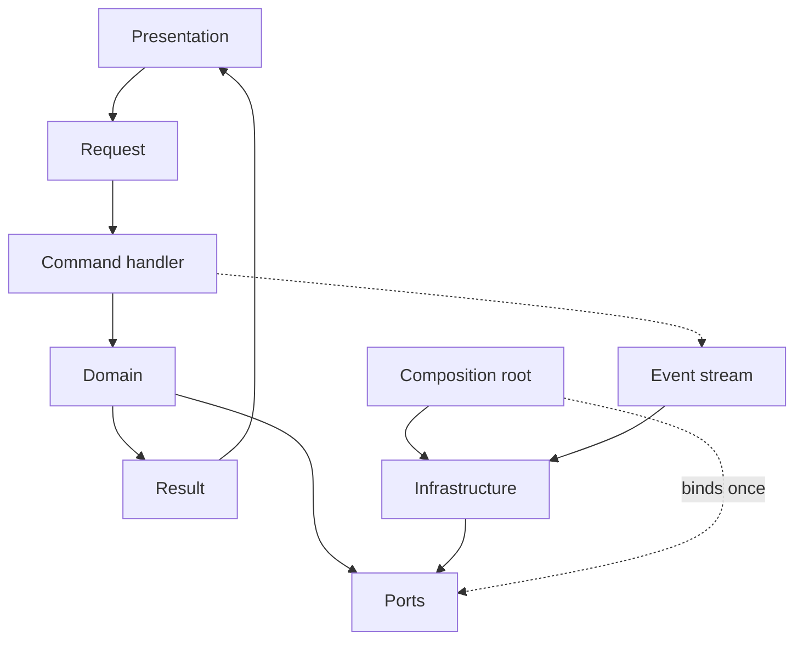

# Frans Elstadt

**Software Engineer**

[Website](https://elstadt.com) · [GitHub](https://github.com/franselstadt) · [LinkedIn](https://linkedin.com/in/frans-elstadt) · [X](https://x.com/franselstadt) · [Email](mailto:franselstadt@gmail.com)

I am a software engineer.

I specify the types a business is allowed to mean, the store those types persist in, the contracts other processes may call, and the path that code takes into a running machine. Then I remain responsible for it. The work is **regulated and operational**: audit, payments, insurance, logistics, health registries, industrial hardware. Other teams, banks, and field operators treat the result as ground truth. Ground truth does not get to be a framework tutorial.

I write in **statically typed** languages — C#, Java, C++. Most engineers are fluent in a host. I am fluent in a kernel: types, ports, composition, and control flow that the compiler can see. If Domain can import a driver, an ORM, or a vendor SDK, it is not a kernel. It is a second Infrastructure that someone named Domain.

---

## Most engineers, this engineer

The default career is speed in the stack of the year. Entities are rows. Services are transaction scripts. Controllers catch exceptions. Architecture is the folder the tutorial used. SOLID is five slides. DDD is a class named `Repository`. That ships. It also means the business language never becomes a type, so every new host is a rewrite dressed as a migration.

I start from the names the business already uses. A session, a ledger line, a shipment, a settlement — an **Item**. A set of them — a **Collection**. A query that is not that thing — a **ViewItem**. A single business action — a **command**, one handler, one typed result. Expected failure — a **value**, not a stack unwind. History, where the law requires it — an **event stream**, not a last-write-wins row.

The compiler is the design review. Substitutions other codebases allow, this one refuses.

| Default engineer | This kernel |
| --- | --- |
| Starts from the framework | Starts from the type |
| ORM entity = the domain | Item = the domain; the row is an adapter |
| Controller opens a unit of work | Presentation calls a command; the handler never sees a connection |
| One controller, twenty actions | **REPR** — one request, one handler, one response |
| `throw` / `catch` for expected failure | **Result** — success or domain error, both types |
| Nested `if` / `is` / visitor | **ADTs** — closed hierarchies, exhaustive match |
| Last row wins | **Event stream** — the table is a projection |
| `Repository` is a DAO with better branding | Persistence is a port **owned by Domain**, bound once |
| DTO in the UI, row in the store | ViewItem in Domain — a query is a type, not a map |
| Clean architecture = four folders that still import the ORM | Domain compiles with **zero** drivers |
| SOLID as a slide deck | SOLID as a **failed build** |
| Interface on every class | Small ports — a worklist reader does not take `Delete` |
| One service, forty methods | One command, one reason to change |
| Microservices as the design | Types first; process topology is Infrastructure |
| DI container as architecture | Composition root is **one assignment**; then the graph is closed |
| Null persistence, catch it later | Uncomposed I/O **throws** — that is a bug, not a Result |
| Anemic objects + logic in services | Item owns `Create Read Update Delete` |

Most profiles list a stack. This one states the constraints the stack is not allowed to violate. Most engineers have one control-flow primitive: throw. A kernel has two: a **bugcheck** and a **status**. Uncomposed I/O, broken invariants, impossible states — throw. Insufficient funds, duplicate session, unknown command — `Result`. Mixing them is how production becomes a stack trace with a business name in it.

---

## Architecture

Presentation calls Application. Application is commands. Domain is types. Domain has no I/O. Architecture composes the process once, at start. Infrastructure implements ports. Workers take the long jobs.

```
Presentation     host: HTTP, UI, services, jobs
      │
Application      REPR — Request → handler → Result<Response>
      │
Domain           Items, Collections, ViewItems, errors, events, ports
      │
Architecture     composition root, session, process catalog
      │
Infrastructure   store, bus, stream, cloud, hardware
Workers          reports, batches, projections, side effects at the edge
```



Dependencies point inward. The only concrete assignment of store → port is the composition root. If that has not run, the process fails closed. Spring, ASP.NET, Qt, a socket server, a batch job — hosts. The host can change. The domain does not.

---

## Domain kernel

Persistable types inherit `BaseItem`. Not a DTO. Not a row. One business name, one lifecycle:

`Create` / `Read` / `Update` / `Delete` — synchronous and asynchronous.

Sets inherit `BaseCollection<T>` (generics in C# and Java, templates in C++):

`CreateItems` / `ReadItems` / `UpdateItems` / `DeleteItems`.

A ViewItem has no `Create()`. If it could inherit `BaseItem`, Liskov is already broken. Other engineers paper over that with a mapper. The compiler should refuse it.

```
Domain
  Items         BaseItem · Item · ViewItem · ItemPersistence
  Collections   BaseCollection<T> · ItemCollection<T> · CollectionPersistence
  Results       Result<T> · Error                        closed set of failures
  Events        Event · EventStream                      history as types
  Commands      Request · Handler · Response             one action
```

The Item calls `Create()`. It does not know SQL, a procedure, a test double, or another process. Domain owns the port. Infrastructure implements it. The composition root assigns it.

---

## Result — failure is a type

Expected failure is not exceptional. It is data.

A handler returns `Result<T>`: a success value, or a domain error. Both are types. The caller must match. There is no hidden `catch` three frames up that turns a business rule into a 500. There is no stack walk for “this invoice cannot settle.” Exceptions exist for what the type system cannot name: broken invariants, uncomposed persistence, I/O the process cannot continue through.

That is an explicit contract. It is also cheaper: a status object is not a stack trace. In C# this is a discriminated union and a switch expression. In Java, sealed types. In C++, `std::expected` or a variant. Same idea. The default engineer throws because the language made it easy. I return a Result because the domain made it required.

---

## Command — one request, one handler, one response

A controller with twenty actions is a folder that learned HTTP. I use **REPR**: Request, Endpoint (handler), Response.

Each business action is an immutable request. The handler is a dedicated type — one class, or one function — that takes that request and returns `Result<Response>`. Inputs in, result out. Side effects live behind ports, composed before the handler runs, never constructed inside it. Tests pass a request. They do not stand up a host.

Single responsibility is mechanical here: a new action is a new handler, not a new method on a god object. The pipeline (auth, session, logging) is middleware around a function, not a base controller that every action inherits by accident.

---

## Algebraic types — exhaustiveness is the review

Domain states and domain errors are **closed**. Paid, pending, reversed. Insufficient funds, duplicate, not found. Not a string. Not an `int` code. A sum type.

Pattern matching replaces the visitor and the nested `is`. The compiler proves every arm exists. A new error that nobody handled is a failed build, not a silent default. List and sequence patterns belong in the same family: inspect a stream of events by shape, not by index and hope.

A ViewItem is this idea applied to reads. An Error is this idea applied to failure. An Event is this idea applied to time. Other engineers simulate it with enums and comments. I let the type system close the set.

---

## Event sourcing — history is the store

Where the law, the ledger, or the operator needs to know *what happened*, the source of truth is not the last row. It is an immutable sequence of events. The current table is a **projection** — a ViewItem rebuilt from the log. Append-only. Chronological. Auditable by construction.

The stream is enumerated asynchronously: C# `IAsyncEnumerable<T>`, Java reactive flow, C++ coroutines. Same contract — pull state transitions without loading the world into a list. Workers project. Handlers append. Domain names the event. Infrastructure stores the bytes.

Not every Item is an event-sourced aggregate. A named thing with a lifecycle is still an Item. When the invariant is history, the Item’s memory is the stream. Default engineers update in place and write an audit table afterwards. That is two sources of truth. I keep one.

---

## SOLID, as shipped

Other engineers can name the five letters. I care whether they fail the build.

**Single responsibility.** An Item changes when the concept changes. A handler changes when the action changes. An adapter changes when the store changes. A Result error changes when the domain learns a new failure. A class that changes for all of those is a “service.”

**Open/closed.** New store, new Infrastructure. New command, new handler. New event, new arm in the match — and a failed build until it exists. Domain is not edited to add a driver.

**Liskov.** A ViewItem is not an Item. A Result error is not an exception. A projection is not an event. If `Delete` would throw `NotSupported`, you modeled a query as an entity.

**Interface segregation.** Item persistence is not collection persistence. A reader of a worklist does not take `Delete`. A handler that cannot fail does not return a swamp of errors it never produces.

**Dependency inversion.** Domain defines ports. Infrastructure depends on Domain. The composition root is the one concrete assignment. If Domain cannot compile without a framework or a driver on the classpath, include path, or package graph — you inverted the slide, not the dependency.

---

## Constraints

- **Types first.** Classes, interfaces, closed hierarchies. Maps, untyped payloads, and framework entities are not a domain.
- **Result for expected failure. Throw for bugs.** Never the reverse.
- **One request, one handler, one response.** Two actions, two handlers.
- **Closed sets.** States, errors, events — exhaustive match. No default arm that swallows tomorrow.
- **Compose once.** Bound at process start. Then the graph is closed.
- **Fail closed.** Silent null persistence is an incident queued on the first real traffic.
- **Name it or it is not an Item.** A join is a ViewItem. A what-happened is an Event.
- **One history.** If you event-source, the row is a projection. Do not keep a second truth.
- **Queries and streams stay in Infrastructure.** Hot paths are still written and tuned. Domain does not perform them.
- **Workers own side effects that are not the model.** Reports, projections, device I/O — never methods on an Item.
- **Explicit over implicit.** Explicit types, explicit visibility, no hidden I/O, no ambient catch.

Same kernel in C#, Java, or C++. Same kernel in any host. The adapters change. The domain does not. Most engineers replace the model when they replace the framework. I replace the adapter.
