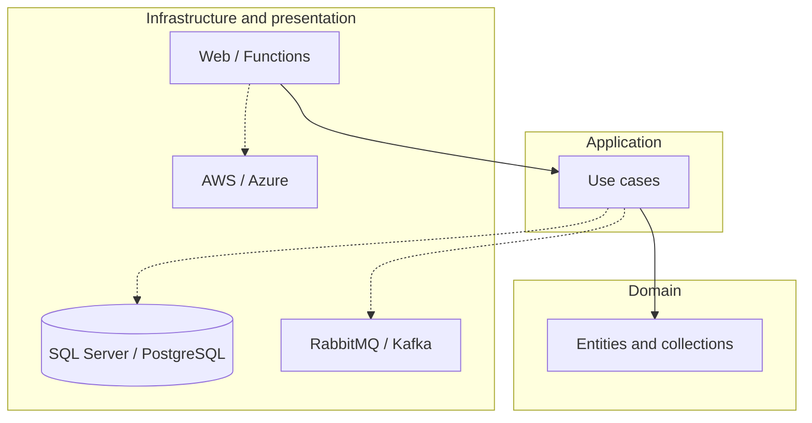

# Frans Elstadt

**Systems engineer** — C# / .NET, data, and cloud backends for operational software.

[Website](https://elstadt.com) · [GitHub](https://github.com/franselstadt) · [LinkedIn](https://linkedin.com/in/frans-elstadt) · [X](https://x.com/franselstadt) · [Email](mailto:franselstadt@gmail.com)

I am a backend and platform engineer. I design the domain model, the persistence, the APIs, and the deployment path, then stay with the system in production. The work is usually **regulated and operational**: audit, payments, insurance, logistics, health registries, industrial hardware — software that other teams, banks, or field operators depend on every day.

The stack is typically **C# / .NET** and **SQL** (SQL Server or PostgreSQL), with REST and event-driven services (RabbitMQ, Kafka), and **AWS or Azure** underneath. On the hot path I still write and tune SQL from execution plans. Around the edges: ERP (SAP, Sage, IBM TM1), payment rails (EMV, ISO 8583, PAIN XML), and shop-floor devices (Zebra/Honeywell, scales, embedded boards).

Architecturally I treat the domain as the center. Application use cases sit on top of it. Infrastructure — databases, brokers, cloud SDKs — is a plugin. If the domain project can see Entity Framework, the design is already wrong.

---

## Experience

### Senior Software Engineer — Draftworx
*May 2024 – March 2026*

Multi-tenant C# .NET and SQL Server audit platform supporting US GAAP, UK IFRS, and XBRL, used by firms across Europe, Africa, Australia, and the United States.

- Led a team of six engineers (planning, reviews, architecture, stakeholder reporting).
- REST APIs and microservices with RabbitMQ and Kafka; API versioning for integrated clients.
- SQL and C# performance work: execution-plan analysis, indexing, N+1 elimination, async pipeline tuning.
- CI/CD targeting Azure or AWS from the same codebase via pipeline parameters.
- Integrations with SAP, Sage, IBM Cognos TM1, QuickBooks, and Pastel.

### Founder / Senior Software Engineer — Elstadt Industries (Mitig8)
*April 2023 – May 2024*

National multi-tenant insurance platform for insurers, brokers, and surveyors. ASP.NET and SQL Server. [Mitig8-WEB](https://github.com/franselstadt/Mitig8-WEB).

- 20,000+ reports annually; integrations with major South African banks.
- Payment stack: EMV, ISO 8583, QR wallets, PAIN XML batch settlement, reconciliation, audit trails.
- Schema, APIs, billing, security, and production operations.

### Lead Software Engineer — WAM Technology
*November 2022 – May 2023*

- South African TB / HIV national registry (government SLA, audit-grade data governance).
- Domain-driven design across bounded contexts.
- Farm payroll and operations, including Android Bluetooth piecework weighing and ESP32 hardware.
- ESP32 diagnostic prototype with TensorFlow slide analysis ([Detecting_Tuberculosis_CNN](https://github.com/franselstadt/Detecting_Tuberculosis_CNN)).

### Software Architect — Hatronika
*April 2023 – May 2024 · concurrent*

AWS IoT backend for a solar controller network (EC2, S3, RDS): schema, payment gateway, LoRaWAN device topology. Technical due diligence for City Venture Capital.

### Staff Software Engineer — City Logistics
*February 2016 – October 2022*

Enterprise software for a 1,200-truck national logistics operation: warehouse, scanning, telematics, costing, and financial reporting.

- Last-mile suite (customer tracking, dispatch, back office).
- Zero-downtime SQL Server to PostgreSQL migration; report times to about one-third of baseline.
- Android apps for Honeywell and Zebra PDAs; Datamax printers, industrial scales, serial hardware.
- IBM Planning Analytics (TM1) fed from SAP and Sage VIP.
- Multi-region CI/CD; Windows Forms to web and service-oriented architecture.

---

## Selected work

| Project | Description | Link |
| --- | --- | --- |
| CityOps | Government operations platform (DDD, GASB, vendor adapters, GIS, Azure Functions) | [merced.elstadt.com](https://merced.elstadt.com) |
| Gallo Platform | .NET 10 integration demo (SAP, SuccessFactors, UiPath, Prometheus, versioned API) | [gallo.elstadt.com](https://gallo.elstadt.com) |
| CorVel DataHub | Event-driven integration hub (sagas, Azure Functions, translation layer) | [corvel.elstadt.com](https://corvel.elstadt.com) |
| BunEHR | EHR implementing the openEHR REST API v1 (Bun, Hono, PostgreSQL) | [BunEHR](https://github.com/franselstadt/BunEHR) |
| Mitig8 | Insurance survey and valuation web application | [Mitig8-WEB](https://github.com/franselstadt/Mitig8-WEB) |
| TrajanOne | Case / medical-record platform (C#) | [TrajanOne](https://github.com/franselstadt/TrajanOne) |
| KitchenOS | C# application | [KitchenOS](https://github.com/franselstadt/KitchenOS) |
| codebase-memory-mcp | Code intelligence MCP server | [codebase-memory-mcp](https://github.com/franselstadt/codebase-memory-mcp) |

---

## Architecture

Presentation and infrastructure depend on application and domain. Domain has no I/O. Brokers sit behind an application interface so RabbitMQ, Kafka, or an in-memory double can be swapped without touching business rules.

---

## Technical skills

  

- **Languages:** C# / .NET (ASP.NET, WPF, WinForms, Blazor), SQL, TypeScript, Java, Go, Node.js  
- **Data:** SQL Server, PostgreSQL, AWS RDS, Cosmos DB, SQLite  
- **Cloud:** AWS (EC2, S3, RDS, IAM, VPC), Azure (App Services, Functions), Docker, Kubernetes, Terraform  
- **Integration:** REST, SOAP, RabbitMQ, Kafka, SAP, Sage, IBM TM1, SWIFT  
- **Payments:** EMV, ISO 8583, PAIN XML, QR wallets  
- **Hardware / IoT:** Zebra/Honeywell PDAs, industrial printers and scales, ESP32, STM32, Raspberry Pi, LoRaWAN  

**Certifications:** AWS Networking (100th percentile) · Azure AI Fundamentals · MCSD · ASCP · IBM TM1 10.1 · CS50x · CCNA I  

**Education:** B.Tech, Computer Software Engineering — Nelson Mandela University · Accounting Sciences — UNISA

---

  
  

